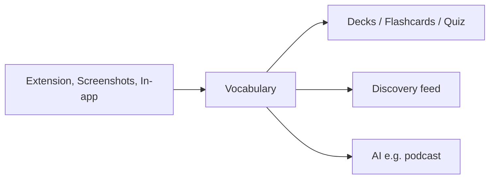

# Decky — Project context for AI and developers

## Overview

**Decky** is a language learning and vocabulary app. It has:

- **Mobile app** (this repository): study decks, flashcards, quizzes, vocabulary, discovery feed, and AI-generated content.
- **Chrome extension**: users capture words from video and web content; words sync into their vocabulary in the app.

Users build a personal vocabulary and study with **decks**, **flashcards**, and **quizzes**.

---

## Where vocabulary comes from

Users add words from:

- **Video / streaming platforms**: from subtitles or captions while watching content. Refer to these only in generic terms (e.g. “video platforms”, “streaming”, “video content”). Do **not** use any third-party platform or brand names (e.g. YouTube, Netflix, Amazon Prime) in the app or in translation files.
- **Screenshots**: users select words from their own screenshots and add them to their vocabulary.

---

## Core features

- **Vocabulary**: Add, manage, and grow word lists (synced from extension, from screenshots, or added in-app).
- **Decks**: Create decks and study with **flashcards** (flip cards, review).
- **Quiz**: Practice with quizzes based on vocabulary.
- **Discovery feed**: Short-form, vertical-scroll feed where users browse and discover words (doomscrolling-style). Do not reference specific social app names in copy; use generic terms (e.g. “feed”, “discovery”).
- **AI-generated content**: e.g. podcasts generated from the user’s selected words. **Onboarding** collects interests to personalize this.

---

## Copy and legal rules

- **No third-party brand names** in the mobile app: no YouTube, Netflix, Amazon Prime, TikTok, Instagram, or similar in UI, translation files, or any user-facing copy. Use only generic terms (video, streaming, short-form feed, social feed, etc.).
- **Translations**: All user-facing text must come from translation files (e.g. `src/lang/translation-files/`). No hardcoded strings. When adding or editing translation keys and values, never use third-party platform or brand names.

---

## Tech and code rules

- **Feature-based structure**: Code must follow feature-based architecture under `src/features/` (e.g. `home`, `flashcards`, `quiz`, `vocabulary`).
- **Stack**: TypeScript, NativeWind, HeroUI Native. No `any`; no `null` (use `undefined` where a value is optional).
- **i18n**: Use the typed translation hook and `TranslationKey` from `src/lang`; do not pass raw string keys.
